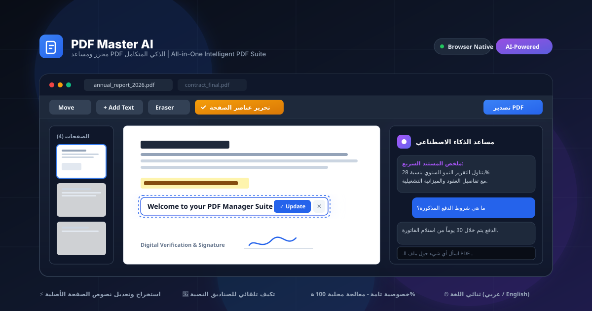

<div align="center">



# 📄 PDF Master AI | محرر ومساعد PDF الذكي الشامل

**منصة متقدمة وشاملة لعرض، تحرير، تنظيم، وتلخيص مستندات الـ PDF مع معالجة محلية آمنة 100% داخل المتصفح.**

[](https://react.dev/)
[](https://www.typescriptlang.org/)
[](https://vitejs.dev/)
[](https://tailwindcss.com/)
[](#)
[](#)

[العربية (الأساسي)](#-الدليل-العربي) • [English (Secondary)](#-english-guide)

---

</div>

<div dir="rtl">

# 📖 الدليل العربي

## 🌟 نظرة عامة على المشروع

**PDF Master AI** هو تطبيق ويب متكامل واحترافي للتعامل مع ملفات ومستندات الـ PDF مباشرة من المتصفح دون الحاجة لتثبيت برامج خارجية أو الاعتماد على خدمات مدفوعة. يجمع التطبيق بين أدوات التحرير التفاعلي الدقيقة، وأدوات إدارة المستندات (دمج، تقسيم، ترتيب، وتدوير)، مع قوة الذكاء الاصطناعي لتحليل محتوى المستندات والإجابة عن الأسئلة بدقة فائقة، مع الحفاظ الكامل على سرية وخصوصية بياناتك.

---

## 🚀 أبرز المميزات والإمكانيات

### 1. ✏️ محرر الصفحات التفاعلي المباشر (Live Page Editor)
- **فك قفل عناصر الصفحة الأصلية (Unlock Original Elements)**:
  - يقوم التطبيق بمسح واستخراج الكلمات والنصوص الموجودة داخل ملف الـ PDF الأصلي وتحويلها إلى عناصر حرة ومستقلة.
  - تغطية تبييض نظيفة لخلفية النص الأصلي لتمكين تعديل الكلمات، نقلها، أو حذفها بنقرة زر (`Delete`).
- **صندوق التعديل المتكيف التلقائي (Adaptive Auto-Sizing Box)**:
  - يتكيف صندوق التعديل تلقائياً وفورياً مع حجم وطول الكلمات المحددة؛ يكبر بسلاسة إذا كان النص طويلاً ويتقلص إذا كان قصيراً دون اقتطاع أو إخفاء أي كلمة.
  - دعم كامل للنصوص باللغة العربية والإنجليزية ومطابقة حجم الخط.
- **أداة الممحاة والتبييض الذكية (Smart Eraser & Redaction)**:
  - إمكانية مسح وتبييض أي نص أو جدول أو جزء حساس في المستند بالسحب أو بالنقر المباشر السريع.
- **أداة التظليل والتمييز (Highlighter Tool)**:
  - تظليل الفقرات والكلمات المهمة بلون أصفر ناصع مع شفافية مريحة للعين.
- **إضافة عناصر جديدة بحرية**:
  - كتابة نصوص جديدة وتغيير الخط والألوان والحجم.
  - إدراج الصور والتواقيع الرقمية اليدوية بحرية مع مقابض لتغيير الحجم والتحريك بالسحب والإفلات.

---

### 2. 📑 إدارة وتنظيم صفحات الـ PDF (Document Management)
- **إعادة الترتيب بالسحب والإفلات (Drag & Drop)**: ترتيب صفحات المستند بسهولة وبصرية مباشرة.
- **تدوير الصفحات**: تدوير فردي لكل صفحة بزاوية 90° أو 180° أو 270°.
- **حذف واستخراج الصفحات**: تحديد أي صفحة وحذفها أو استخراجها في ملف منفصل.
- **دمج ملفات متعددة (Merge PDFs)**: دمج أكثر من ملف PDF في مستند واحد موحد وبترتيب مخصص.
- **تقسيم المستندات (Split PDF)**: تقسيم الملفات الكبيرة إلى مستندات أصغر أو صفحات محددة.

---

### 3. 🤖 المساعد الذكي للمستندات (AI PDF Assistant)
- **تلخيص المستند بضغطة زر**: استخراج النقاط الأساسية والمحتوى الجوهري للملف في ثوانٍ معدودة.
- **المحادثة وطرح الأسئلة (Ask PDF / Document Q&A)**:
  - إمكانية توجيه أي استفسار حول ملف الـ PDF (مثل: "ما هي شروط العقد؟"، "كم يبلغ إجمالي المصروفات؟").
  - إجابات دقيقة تستند إلى سياق المستند الفعلي باللغتين العربية والإنجليزية.

---

### 4. 🔒 الأمان والخصوصية الفائقة (100% Client-Side)
- جميع عمليات المعالجة البصرية، تعديل النصوص، تدوير ودمج وتقسيم الصفحات تتم **محلياً بالكامل داخل متصفح المستخدم** بواسطة مكتبات Web Assembly و JavaScript الحديثة (`pdf-lib` و `pdfjs-dist`).
- ملفاتك ومستنداتك الحساسة لا تغادر جهازك إلى أي خادم خارجي عند التحرير أو الدمج.

---

### 5. 🌐 واجهة مستخدم ثنائية اللغة متكاملة
- دعم كامل للغة **العربية (RTL)** واللغة **الإنجليزية (LTR)** بتبديل فوري بنقرة واحدة.
- تصميم متجاوب وأنيق يناسب أجهزة الكمبيوتر المكتبية والمحمولة والأجهزة اللوحية.

---

## 🛠️ التقنيات المستخدمة (Tech Stack)

- **الواجهة الأمامية**: [React 19](https://react.dev/) مع [TypeScript](https://www.typescriptlang.org/)
- **أداة البناء**: [Vite](https://vitejs.dev/)
- **التنسيق والتصميم**: [Tailwind CSS](https://tailwindcss.com/) مع دعم الوضع الداكن وتوافق RTL/LTR
- **معالجة وتعديل مستندات الـ PDF**:
  - `pdf-lib`: لإنشاء وتعديل ودمج وتقسيم وحفظ ملفات الـ PDF.
  - `pdfjs-dist`: لعرض صفحات الـ PDF، الرندرة عالية الدقة، واستخراج النصوص الأصلية.
- **الأيقونات**: [Lucide React](https://lucide.dev/)
- **الذكاء الاصطناعي**: [Google Gen AI SDK](https://www.npmjs.com/package/@google/genai) للتحليل والاستفسار الذكي.

---

## 💻 طريقة التثبيت والتشغيل محلياً

### المتطلبات الأساسية
- تثبيت [Node.js](https://nodejs.org/) (الإصدار 18 أو أحدث).
- مدير حزم مثل `npm` أو `bun` أو `pnpm`.

### خطوات التشغيل:
1. **استنساخ المستودع (Clone the repository)**:
   ```bash
   git clone https://github.com/your-username/pdf-master-ai.git
   cd pdf-master-ai
   ```

2. **تثبيت الحزم والاعتماديات (Install dependencies)**:
   ```bash
   npm install
   ```

3. **إعداد المتغيرات البيئية (اختياري لميزات الذكاء الاصطناعي)**:
   - قم بإنشاء ملف `.env` في المجلد الرئيسي وإضافة مفتاح Gemini API في حال الرغبة بتفعيل الذكاء الاصطناعي:
   ```env
   GEMINI_API_KEY=your_api_key_here
   ```

4. **تشغيل خادم التطوير (Run Development Server)**:
   ```bash
   npm run dev
   ```
   افتح المتصفح على العنوان التالي: `http://localhost:3000`

5. **بناء النسخة الإنتاجية (Build for Production)**:
   ```bash
   npm run build
   ```

---

## 📋 دليل الاستخدام السريع

1. **إضافة ملفات**: اسحب ملف أو أكثر من ملفات الـ PDF وأفلتها في نافذة التطبيق أو انقر على **اختيار ملف**.
2. **عرض وإدارة الصفحات**: استعرض الصفحات في الشريط الجانبي أو شبكة الصفحات، وقم بتدوير أو حذف أو تغيير ترتيب الصفحات بالسحب.
3. **تعديل صفحة محددة**: انقر على أيقونة **تعديل الصفحة** لفتح محرر الكانفاس المباشر.
4. **تحرير نصوص المستند الأصلي**:
   - اضغط على زر **تحرير عناصر الصفحة (Unlock Original Elements)** ذو اللون الذهبي.
   - ستتحول نصوص الصفحة إلى عناصر حرة ومحررة.
   - انقر مرتين على أي نص لبدء التعديل، حيث يتكيف صندوق التعديل تلقائياً مع حجم النص، ثم اضغط على **تحديث النص** أو زر `Enter`.
   - اسحب النص لنقله أو اضغط على مفتاح `Delete` لحذفه.
5. **استخدام الممحاة والتظليل**: اختر أداة **الممحاة** لمحو الأجزاء المرغوبة، أو أداة **التظليل** لتمييز العبارات الهامة.
6. **تصدير وحفظ المستند**: بعد الانتهاء، انقر على زر **تصدير وحفظ PDF** لتوليد ملف الـ PDF المعدل وتنزيله فوراً.

</div>

---

<div dir="ltr">

# 📘 English Guide

## 🌟 Overview

**PDF Master AI** is a comprehensive, client-side web application designed for editing, organizing, annotating, and analyzing PDF documents directly in your web browser. It combines high-precision visual PDF manipulation tools with the analytical power of Gemini AI—all while guaranteeing absolute privacy by processing your files locally.

---

## 🚀 Key Features

- **Live Page Canvas Editor**:
  - **Unlock Native Page Elements**: Automatically scans underlying PDF text streams and converts them into editable, movable, or deletable objects with neat background whiteout masks.
  - **Adaptive Auto-Sizing Text Box**: The editing input dynamically expands or contracts in real time based on text length and typography, ensuring zero word truncation.
  - **Smart Eraser & Whiteout**: Erase sensitive data, text, or elements via drag selection or single-click patches.
  - **Highlighter Tool**: Mark key paragraphs and figures with glowing yellow transparency.
  - **Free Text, Images & Digital Signatures**: Add customized typography, import graphic seals or logos, and sign documents with a digital pen.
- **Document Organization**:
  - Drag-and-drop page reordering.
  - Page rotation (90°, 180°, 270°).
  - Page deletion and extraction.
  - Seamless PDF merging and splitting.
- **AI-Powered Insights**:
  - Instant executive summaries of lengthy documents.
  - Interactive "Ask PDF" question-and-answer assistant grounded in document context.
- **100% Browser-First Privacy**:
  - Documents are processed locally via Web APIs, `pdf-lib`, and `pdfjs-dist`. No server uploads required for viewing, editing, or merging.
- **Full Bilingual RTL/LTR Support**:
  - Fully localized Arabic and English interfaces with instant one-click switching.

---

## 🛠️ Tech Stack

- **Framework**: React 19 + TypeScript
- **Bundler**: Vite
- **Styling**: Tailwind CSS (Dark/Light mode & RTL/LTR adaptive)
- **PDF Core Engines**: `pdf-lib` and `pdfjs-dist`
- **Icons**: Lucide React
- **AI Integration**: `@google/genai` (Google Gen AI TypeScript SDK)

---

## 💻 Local Setup & Installation

```bash
# 1. Clone the repository
git clone https://github.com/your-username/pdf-master-ai.git
cd pdf-master-ai

# 2. Install dependencies
npm install

# 3. (Optional) Set up your Gemini API key in .env
echo "GEMINI_API_KEY=your_gemini_api_key" > .env

# 4. Start the development server
npm run dev

# 5. Build for production
npm run build
```

---

## 📄 License

This project is licensed under the **MIT License**.

</div>
